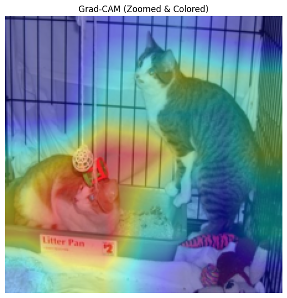
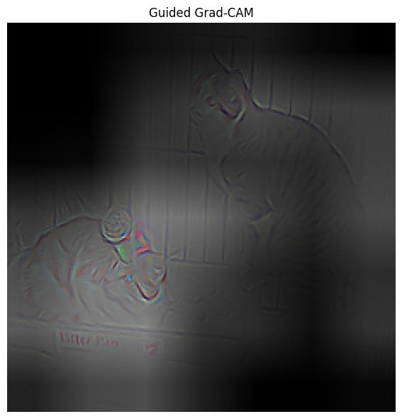
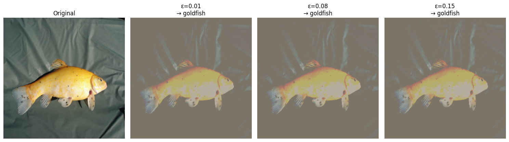
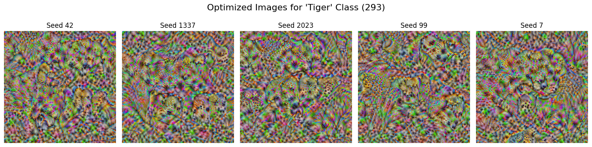

# Image Model Explainability & Adversarial Robustness

This repository explores how deep Convolutional Neural Networks (CNNs) "see" images and how vulnerable they are to adversarial attacks. We use pre-trained models (ResNet50 and VGG16) to generate visual explanations and test model robustness.

## Overview

### 1. Visual Explanations (Grad-CAM & Guided Backpropagation)
Deep learning models are often considered "black boxes." To interpret their decisions, we implemented the following techniques on a **ResNet50** model using the Cats vs. Dogs dataset:
*   **Grad-CAM:** Generates heatmaps highlighting the regions most important for the model's prediction.
*   **Guided Backpropagation:** Produces high-resolution saliency maps showing fine-grained details (like edges) that activated the network.
*   **Guided Grad-CAM:** Combines both techniques for a high-resolution, class-discriminative visualization.
*   **Feature Visualization:** Visualized individual feature maps from intermediate convolution layers to understand what specific filters detect.

### 2. Adversarial Attacks & Robustness
We evaluated the robustness of a **VGG16** model against adversarial noise using samples from ImageNet:
*   **PGD Attacks:** Implemented Projected Gradient Descent (PGD) attacks with varying intensities ($\epsilon = 0.01, 0.08, 0.15$). We observed how imperceptible noise not only flipped the model's prediction (e.g., from 'tench' to 'goldfish') but also significantly altered the network's attention (Grad-CAM maps).
*   **Class Feature Visualization:** Generated synthetic, optimized images to maximize the activation of a specific class (e.g., 'Tiger' - class 293). We applied **Total Variation Regularization** and **Random Shift (Jittering)** to produce stable, more human-interpretable patterns.

---

## Sample Outputs

### Visual Explanations (Grad-CAM)
Original Image vs. Grad-CAM (Zoomed & Colored) showing model attention:
<br>


### Guided Grad-CAM
Combining Grad-CAM with Guided Backpropagation for fine-grained detail:
<br>


### PGD Adversarial Attack
The effect of PGD attacks on an image of a 'tench', flipping the prediction to 'goldfish' even at $\epsilon = 0.01$:
<br>


### Class Feature Visualization
Optimized input noise to maximize the activation of the 'Tiger' class using TV Regularization and Jittering:
<br>


---

## Installation & Usage

1. Clone the repository:
```bash
git clone [https://github.com/yourusername/image-model-explainability-robustness.git](https://github.com/yourusername/image-model-explainability-robustness.git)
cd image-model-explainability-robustness# image-model-explainability-robustness
Implementation of visual explainability techniques (Grad-CAM, Guided Backprop) on ResNet50 and evaluation of VGG16 robustness against PGD adversarial attacks, including class feature visualization.
